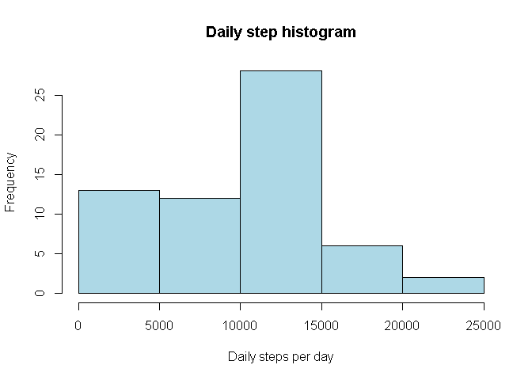
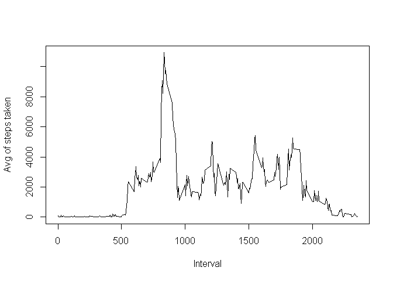
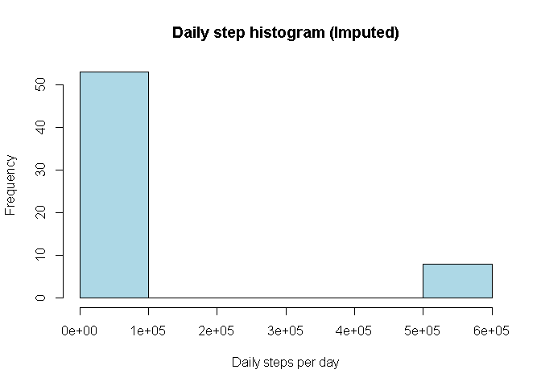

# Reproducible Research: Peer Assessment 1
S R Mirkhani  
Saturday, March 14, 2015  


## Loading and preprocessing the data


```r
if (!"data.table" %in% installed.packages()) install.packages(data.table)
library(data.table)
```

```
## 
## Attaching package: 'data.table'
## 
## The following object is masked _by_ '.GlobalEnv':
## 
##     .N
```

```r
activity_dt <- data.table(read.csv("activity.csv"))
```

## What is mean total number of steps taken per day?

```r
daily_activity_dt <- activity_dt[,list(total_daily_steps=sum(steps, na.rm = TRUE)),by=date]
```

```r
hist(daily_activity_dt$total_daily_steps, col="lightblue",
     main = "Daily step histogram", xlab = "Daily steps per day")
```

 

```r
mean(daily_activity_dt$total_daily_steps, na.rm = TRUE)
```

```
## [1] 9354.23
```

```r
median(daily_activity_dt$total_daily_steps, na.rm = TRUE)
```

```
## [1] 10395
```


## What is the average daily activity pattern?

```r
interval_steps_dt <- activity_dt[,list(total_daily_steps=sum(steps, na.rm = TRUE)),by=interval]
```

```r
plot(interval_steps_dt, type = "l", ylab = "Avg of steps taken", xlab = "Interval")
```

 

```r
max_steps_per_interval <- max(interval_steps_dt$total_daily_steps)
interval_steps_dt[total_daily_steps  == max_steps_per_interval]
```

```
##    interval total_daily_steps
## 1:      835             10927
```


## Imputing missing values
1. Calculate and report the total number of missing values in the dataset
(i.e. the total number of rows with NAs)

```r
sum(!complete.cases(activity_dt))
```

```
## [1] 2304
```
2. Devise a strategy for filling in all of the missing values in the dataset. The
strategy does not need to be sophisticated. For example, you could use
the mean/median for that day, or the mean for that 5-minute interval, etc.


```r
activity_na_dt <- activity_dt[!complete.cases(activity_dt)]
lookup_avg_step <- function (n_interval) { interval_steps_dt$total_daily_steps[interval_steps_dt$interval == n_interval] }
```

3. Create a new dataset that is equal to the original dataset but with the
missing data filled in.

```r
activity_na_dt$steps = sapply(activity_na_dt$interval, lookup_avg_step)
activity_ok_dt <- activity_dt[complete.cases(activity_dt)]
activity_cleaned_dt <- rbind(activity_ok_dt, activity_na_dt)[order(date, interval)]
head(activity_cleaned_dt)
```

```
##    steps       date interval
## 1:    91 2012-10-01        0
## 2:    18 2012-10-01        5
## 3:     7 2012-10-01       10
## 4:     8 2012-10-01       15
## 5:     4 2012-10-01       20
## 6:   111 2012-10-01       25
```

4. Make a histogram of the total number of steps taken each day and Calculate
and report the mean and median total number of steps taken per day. Do
these values differ from the estimates from the first part of the assignment?
What is the impact of imputing missing data on the estimates of the total
daily number of steps?

```r
daily_activity_dt <- activity_cleaned_dt[,list(total_daily_steps=sum(steps, na.rm = TRUE)),by=date]
```

```r
hist(daily_activity_dt$total_daily_steps, col="lightblue",
     main = "Daily step histogram (Imputed)", xlab = "Daily steps per day")
```

 

```r
mean(daily_activity_dt$total_daily_steps, na.rm = TRUE)
```

```
## [1] 84188.07
```

```r
median(daily_activity_dt$total_daily_steps, na.rm = TRUE)
```

```
## [1] 11458
```

The  mean number of steps using imputed data has increased by a factor of **9**
relative to the actual recorded data

## Are there differences in activity patterns between weekdays and weekends?

For this part the weekdays() function may be of some help here. Use the dataset
with the filled-in missing values for this part.

1. Create a new factor variable in the dataset with two levels - "weekday"
and "weekend" indicating whether a given date is a weekday or weekend
day.

```r
is_week_day <- function(d_day) {
        if (weekdays(d_day) %in% c("Saturday", "Sunday") )
                "weekend"
        else
                "weekday"
}
activity_cleaned_df <- data.frame(activity_cleaned_dt)
dates <- as.Date(activity_cleaned_df$date)
activity_cleaned_df["day_type"] <- as.factor(sapply(dates, is_week_day))
```

2. Make a panel plot containing a time series plot (i.e. type = "l") of the
5-minute interval (x-axis) and the average number of steps taken, averaged
across all weekday days or weekend days (y-axis).

```r
activity_cleaned_dt <- data.table(activity_cleaned_df)
activity_cleaned_week_end_dt <- activity_cleaned_dt[, activity_cleaned_dt$day_type == "weekend"]
activity_cleaned_week_day_dt <- activity_cleaned_dt[, activity_cleaned_dt$day_type == "weekday"]
```
