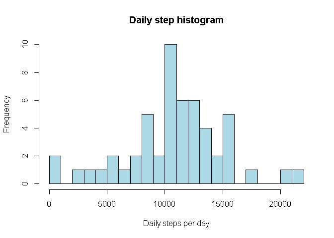
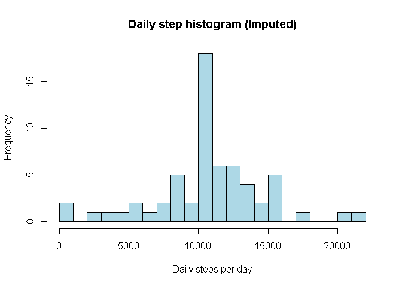
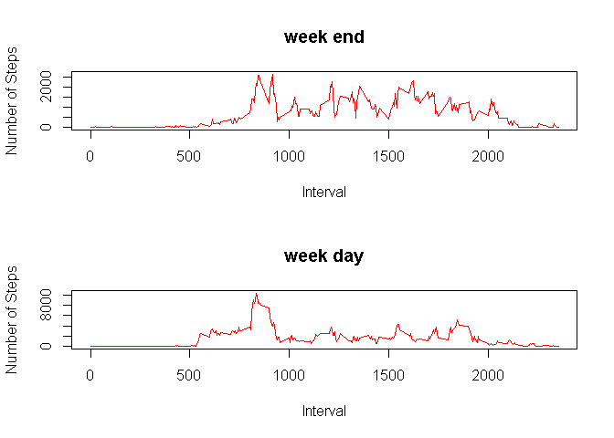

# Reproducible Research: Peer Assessment 1
S R Mirkhani  
Saturday, March 14, 2015  


## Loading and preprocessing the data


```r
if (!"data.table" %in% installed.packages()) install.packages(data.table)
library(data.table)
activity_dt <- data.table(read.csv("activity.csv"))
```

## What is mean total number of steps taken per day?
1. Make a histogram of the total number of steps taken each day  

```r
daily_activity_dt <- activity_dt[,list(total_daily_steps=sum(steps)),by=date]

head(daily_activity_dt)
```

```
##          date total_daily_steps
## 1: 2012-10-01                NA
## 2: 2012-10-02               126
## 3: 2012-10-03             11352
## 4: 2012-10-04             12116
## 5: 2012-10-05             13294
## 6: 2012-10-06             15420
```

```r
hist(daily_activity_dt$total_daily_steps, col = "lightblue",
     main = "Daily step histogram", xlab = "Daily steps per day", breaks = 30)
```

 
  
2. Calculate and report the mean and median total number of steps taken
per day  
  
Mean of total number of steps taken per day

```r
mean(daily_activity_dt$total_daily_steps, na.rm = TRUE)
```

```
## [1] 10766.19
```
  
Median of total number of steps taken per day

```r
median(daily_activity_dt$total_daily_steps, na.rm = TRUE)
```

```
## [1] 10765
```

## What is the average daily activity pattern?
1. Make a time series plot (i.e. type = "l") of the 5-minute interval (x-axis)
and the average number of steps taken, averaged across all days (y-axis)  

```r
interval_steps_dt <- activity_dt[,list(avg_daily_steps=mean(steps, na.rm = TRUE)),by=interval]
plot(interval_steps_dt, type = "l", ylab = "Avg of steps taken", xlab = "Interval")
```

 
  
2. Which 5-minute interval, on average across all the days in the dataset,
contains the maximum number of steps?  

```r
interval_steps_dt[avg_daily_steps ==  max(interval_steps_dt$avg_daily_steps)]
```

```
##    interval avg_daily_steps
## 1:      835        206.1698
```

Interval 835 contains the maximum number of steps on average across all the 
days in the dataset

## Imputing missing values
1. Calculate and report the total number of missing values in the dataset
(i.e. the total number of rows with NAs)  

```r
sum(!complete.cases(activity_dt))
```

```
## [1] 2304
```
  
2. Devise a strategy for filling in all of the missing values in the dataset. The
strategy does not need to be sophisticated. For example, you could use
the mean/median for that day, or the mean for that 5-minute interval, etc.

I'll be using the mean of the 5-minute interval to impute the missing values in 
the data set


```r
activity_na_dt <- activity_dt[!complete.cases(activity_dt)]
lookup_avg_step <- function (n_interval) {
        interval_steps_dt$avg_daily_steps[interval_steps_dt$interval == n_interval]
        }
```
  
3. Create a new dataset that is equal to the original dataset but with the
missing data filled in.

```r
activity_na_dt$steps = sapply(activity_na_dt$interval, lookup_avg_step)
activity_ok_dt <- activity_dt[complete.cases(activity_dt)]
activity_cleaned_dt <- rbind(activity_ok_dt, activity_na_dt)[order(date, interval)]
```
  
4. Make a histogram of the total number of steps taken each day and Calculate
and report the mean and median total number of steps taken per day. Do
these values differ from the estimates from the first part of the assignment?
What is the impact of imputing missing data on the estimates of the total
daily number of steps?

```r
daily_activity_dt <- activity_cleaned_dt[,list(total_daily_steps=sum(steps, na.rm = TRUE)),by=date]

head(daily_activity_dt)
```

```
##          date total_daily_steps
## 1: 2012-10-01          10766.19
## 2: 2012-10-02            126.00
## 3: 2012-10-03          11352.00
## 4: 2012-10-04          12116.00
## 5: 2012-10-05          13294.00
## 6: 2012-10-06          15420.00
```

```r
hist(daily_activity_dt$total_daily_steps, col="lightblue",
     main = "Daily step histogram (Imputed)", xlab = "Daily steps per day", breaks = 30)
```

 
  
Mean of total number of steps taken per day (imputed data)
  

```r
mean(daily_activity_dt$total_daily_steps)
```

```
## [1] 10766.19
```
  
Median of total number of steps taken per day (imputed data)
  

```r
median(daily_activity_dt$total_daily_steps)
```

```
## [1] 10766.19
```
  
The mean number of steps of imputed and the original data are the same
  
The median number of steps of imputed data is approximately 1 step more than
the original data


## Are there differences in activity patterns between weekdays and weekends?

For this part the weekdays() function may be of some help here. Use the dataset
with the filled-in missing values for this part.
  
1. Create a new factor variable in the dataset with two levels - "weekday"
and "weekend" indicating whether a given date is a weekday or weekend
day.

```r
is_week_day <- function(d_day) {
        if (weekdays(d_day) %in% c("Saturday", "Sunday") )
                "weekend"
        else
                "weekday"
}
activity_cleaned_df <- data.frame(activity_cleaned_dt)
dates <- as.Date(activity_cleaned_df$date)
activity_cleaned_df["day_type"] <- as.factor(sapply(dates, is_week_day))
```
  
2. Make a panel plot containing a time series plot (i.e. type = "l") of the
5-minute interval (x-axis) and the average number of steps taken, averaged
across all weekday days or weekend days (y-axis).

```r
activity_cleaned_week_end_dt <- data.table(subset(activity_cleaned_df, day_type == "weekend"))
activity_cleaned_week_day_dt <- data.table(subset(activity_cleaned_df, day_type == "weekday"))

interval_steps_week_end_dt <- activity_cleaned_week_end_dt[,list(total_daily_steps=sum(steps)),by=interval]
interval_steps_week_day_dt <- activity_cleaned_week_day_dt[,list(total_daily_steps=sum(steps)),by=interval]

par(mfrow=c(2,1))       # create panel with 2 rows and one column
plot(interval_steps_week_end_dt, type = "l", ylab = "Number of Steps", 
     xlab = "Interval", main="week end", col = "red")
plot(interval_steps_week_day_dt, type = "l", ylab = "Number of Steps",
     xlab = "Interval", main="week day", col = "red")
```

 
